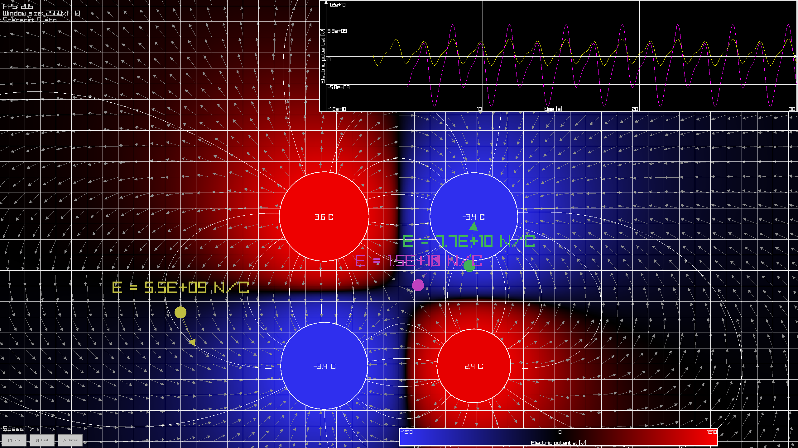

# Electroviz – a visualization of the electric field

Graphical application written in C++ 23 using the [raylib](https://www.raylib.com/)
library that can visualize the electric field of point charges distributed in space.
Created as semester project for my Introduction to Computer Graphics course in
the 2024/2025 academic year.



## Building

Only supported OS is currently Linux. MacOS and Windows should work as well, but
haven't been tested or taken into account beyond what was already in the
[raylib-cpp-starter](https://github.com/CapsCollective/raylib-cpp-starter) template.

First, clone the repository and install the dependencies as described
[here](https://github.com/raysan5/raylib/wiki/Working-on-GNU-Linux).

Then build the project:

```sh
make setup
make build
```

This will create the executable `build/Linux/release/electroviz`. For debug builds,
run `make build DEBUG=1` instead. That will create the executable in a `debug`
folder. For more options see the README of the
[raylib-cpp-starter](https://github.com/CapsCollective/raylib-cpp-starter/blob/main/README.md)
template or read the `Makefile`.

## Running

```sh
electroviz <scenario> [-g<w>x<h>]
```

- `scenario` is the name of a scenario file in the `scenarios` folder
- `w` and `h` is width and height respectively of one cell in the displayed grid
